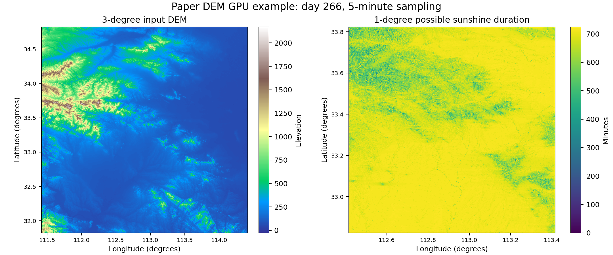

# Global Possible Sunshine Duration

This repository contains source code for estimating terrain-aware possible sunshine duration from digital elevation model (DEM) rasters.

For each valid DEM pixel, the programs sample the solar position between sunrise and sunset and test whether surrounding terrain blocks the direct solar beam. Results are written as GeoTIFF rasters containing accumulated possible sunshine duration in minutes.

The repository contains only the sunshine-duration implementations. The separate `toposolar-*` pipeline, which includes three calculation modes, is not part of this code package.

## Repository Layout

- `src/optimized_gpu/`: recommended CUDA implementation for large DEMs. It supports row batching, multiple CUDA streams, configurable CUDA block dimensions, Earth-curvature correction, and annual processing.
- `src/cpu_only/`: CPU reference implementation for portable checks and small DEMs.
- `src/gpu_native/`: CUDA implementation with a positional command-line interface for single-day calculations.
- `examples/tiny_dem.asc`: small synthetic DEM used only by the portable CI quick test.
- `examples/data/test_dem.tif`: 3-degree DEM used by the GPU example, stored through Git LFS.
- `tests/quick_test_cpu.sh`: portable end-to-end CPU smoke test.
- `tests/run_gpu_example.sh`: runs the optimized GPU code with `examples/data/test_dem.tif`.
- `scripts/files_group.py`: balances GeoTIFF files among processing groups by file size.
- `scripts/numa.py`: multi-GPU scheduler that uses the GPU-to-NUMA topology reported by `nvidia-smi`.
- `scripts/zip_tif.py`: command-line utility for applying loss-controlled GeoTIFF compression.
- `scripts/plot_test_result.py`: creates the example result figure from the DEM and output GeoTIFF.
- `docs/usage.md`: command reference for the three implementations.

## Requirements

### CPU build and quick test

- Linux
- CMake 3.21 or newer
- A C++17 compiler
- `pkg-config`
- GDAL development headers and library
- GDAL command-line tools (`gdal_translate` and `gdalinfo`)
- OpenMP runtime and development support

On Ubuntu and related distributions:

```bash
sudo apt-get update
sudo apt-get install build-essential cmake pkg-config libgdal-dev gdal-bin
```

The native libraries used by the CPU implementation are GDAL, OpenMP, and the standard C/C++ runtime supplied by the compiler toolchain.

### Additional GPU requirements

The GPU implementations additionally require:

- An NVIDIA GPU and compatible driver
- NVIDIA CUDA Toolkit with `nvcc`
- CUDA Runtime (`libcudart`)
- cuBLAS (`libcublas`) for `src/optimized_gpu`

The GPU CMake files first use `CUDAToolkit_ROOT`, then `CUDA_HOME`, and finally `/usr/local/cuda` when available. An explicit toolkit location can be supplied with:

```bash
cmake -S src/optimized_gpu -B build/optimized_gpu \
  -DCUDAToolkit_ROOT=/path/to/cuda
```

The default CUDA architecture is `80`. Override it for another GPU architecture, for example:

```bash
cmake -S src/optimized_gpu -B build/optimized_gpu \
  -DCMAKE_CUDA_ARCHITECTURES=86
```

If GDAL is installed through Conda, activate the environment before configuring and make its runtime libraries visible when necessary:

```bash
export LD_LIBRARY_PATH="$CONDA_PREFIX/lib:${LD_LIBRARY_PATH:-}"
```

### Paper DEM download

The paper DEM is 250,515,066 bytes and is stored with Git LFS. After cloning, download the TIFF with:

```bash
git lfs install
git lfs pull --include=examples/data/test_dem.tif
```

Its SHA-256 checksum is:

```text
540b1018904bb537a5d24f645e767b2d2ae43009962c97e0b99251c24aa6ea81
```

## Quick Test

From the repository root, run:

```bash
bash tests/quick_test_cpu.sh
```

The script checks the required tools, converts the small synthetic `examples/tiny_dem.asc` fixture to a temporary EPSG:4326 GeoTIFF, builds the CPU implementation in a temporary directory, calculates day 80 at a 60-minute interval, and validates the output dimensions, coordinate reference system, valid-pixel statistics, and the physical range of `0` to `1440` minutes. This fast CI fixture is separate from the paper DEM used below.

All generated files are removed when the test finishes. A successful run ends with:

```text
[PASS] CPU quick test completed successfully.
```

## GPU Example with the Paper DEM

The GPU example uses `examples/data/test_dem.tif`. The raster contains 10,801 x 10,801 pixels at approximately 1 arc-second resolution and covers approximately 3 degrees by 3 degrees.

The target result is the central 1-degree by 1-degree area. One degree of surrounding terrain is retained on every side during ray tracing so that terrain outside the target tile can still block the solar beam. The `--pad 1` option removes this one-degree boundary only from the saved output; it does not remove it from the terrain visibility calculation.

GPU 0 and CUDA architecture 80 are used by default:

```bash
bash tests/run_gpu_example.sh
```

Select another device or CUDA architecture through environment variables:

```bash
GPU_ID=7 CUDA_ARCHITECTURE=80 bash tests/run_gpu_example.sh
```

The script calculates day 266 using a 5-minute interval and `--pad 1`. The central result is written to `test-results/gpu-example/output/test_dem/test_dem--_result266.tif`.

The following figure was generated from the 3-degree paper DEM using the optimized implementation on an NVIDIA A800-SXM4-80GB GPU. The left panel shows the full input terrain used for shadow searches; the right panel shows the central approximately 1-degree result.

The recorded GPU 7 run produced a 3,600 x 3,600 output covering exactly 1 degree by 1 degree. The CUDA calculation took approximately 2.96 seconds; valid output values ranged from 0 to 725 minutes, with a mean of 681.98 minutes.



Recreate the figure after running the GPU example:

```bash
python3 scripts/plot_test_result.py \
  examples/data/test_dem.tif \
  test-results/gpu-example/output/test_dem/test_dem--_result266.tif \
  docs/images/paper_dem_gpu_result.png
```

The plotting command requires NumPy, Matplotlib, and the GDAL Python bindings.

## CPU Reference Implementation

Build from the repository root:

```bash
cmake -S src/cpu_only -B build/cpu_only -DCMAKE_BUILD_TYPE=Release
cmake --build build/cpu_only --parallel
```

Run a single day:

```bash
./build/cpu_only/sunshine_hours \
  /path/to/input_dem.tif \
  266 \
  5 \
  /path/to/output.tif
```

The positional arguments are the input DEM, day of year, temporal sampling interval in minutes, and output GeoTIFF. The CPU implementation is intended for small-area checks and does not require CUDA.

## Optimized GPU Implementation

Build:

```bash
cmake -S src/optimized_gpu -B build/optimized_gpu -DCMAKE_BUILD_TYPE=Release
cmake --build build/optimized_gpu --parallel
```

Run a single day:

```bash
./build/optimized_gpu/sunshine_hours \
  --file examples/data/test_dem.tif \
  --gpu 0 \
  --batch 16 \
  --streams 16 \
  --blockx 64 \
  --blocky 4 \
  --day 266 \
  --step 5 \
  --pad 1 \
  --output /path/to/output_directory
```

Important options:

- `--file`, `-f`: input DEM GeoTIFF.
- `--gpu`, `-g`: CUDA device ID.
- `--batch`: number of raster rows processed per batch.
- `--streams`: number of CUDA streams.
- `--blockx`, `--blocky`: CUDA thread-block dimensions.
- `--day`: day of year.
- `--step`: temporal sampling interval in minutes.
- `--pad`: geographic margin retained for terrain-shadow searches but removed from each edge of the saved result. A 3-degree input with `--pad 1` produces the central approximately 1-degree output.
- `--output`, `-o`: output file or output root directory.

For the optimized GPU executable, `--day 365` calculates all days from 1 through 365. Use the CPU executable for a standalone calculation of day 365.

For a single day and an output directory, the optimized implementation writes:

```text
<output_root>/<input_stem>/<input_stem>--_result<day>.tif
```

Annual processing writes `day1.tif` through `day365.tif` under `<output_root>/<input_stem>/`. Days that fail after all retries are recorded in `faillog.txt`.

## GPU-Native Reference Implementation

Build and run:

```bash
cmake -S src/gpu_native -B build/gpu_native -DCMAKE_BUILD_TYPE=Release
cmake --build build/gpu_native --parallel

./build/gpu_native/sunshine_hours \
  /path/to/input_dem.tif \
  266 \
  5 \
  /path/to/output.tif
```

This executable accepts the input DEM, day of year, temporal sampling interval in minutes, and output GeoTIFF as positional arguments.

## Input and Output Conventions

- Input DEMs must be single-band, north-up rasters with no rotation.
- Horizontal pixel sizes must have equal absolute x and y resolution.
- Geographic coordinates in longitude and latitude are expected by the terrain-distance calculations.
- Nodata cells are propagated as invalid output cells.
- Valid output values are possible sunshine duration in minutes.
- The time step controls the temporal approximation: smaller values increase runtime and temporal resolution.
- The optimized GPU implementation removes the configured geographic padding from output edges.
- For terrain-shadow correctness near tile boundaries, provide an input DEM larger than the target area. The paper example uses a 3-degree input, keeps the outer one-degree margins as obstacle terrain, and saves only the central 1-degree result.

## Batch Utilities

Show the command-line interfaces before using the optional utilities:

```bash
python3 scripts/files_group.py --help
python3 scripts/numa.py --help
python3 scripts/zip_tif.py --help
```

The Python compression utility requires NumPy and the GDAL Python bindings. The NUMA scheduler additionally requires `numactl`, `nvidia-smi`, and a multi-GPU Linux host.

## License

This project is distributed under the BSD 3-Clause License. See `LICENSE`.
